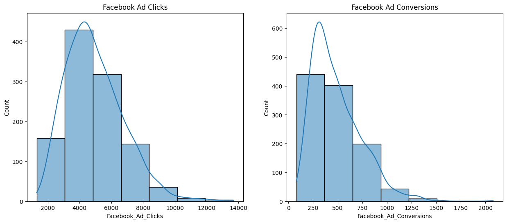
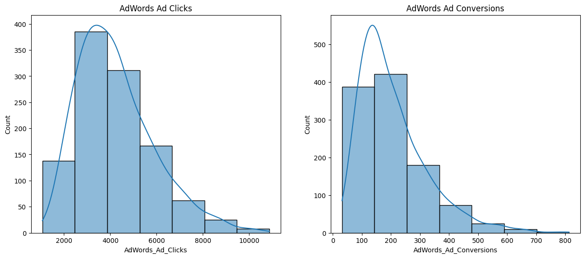
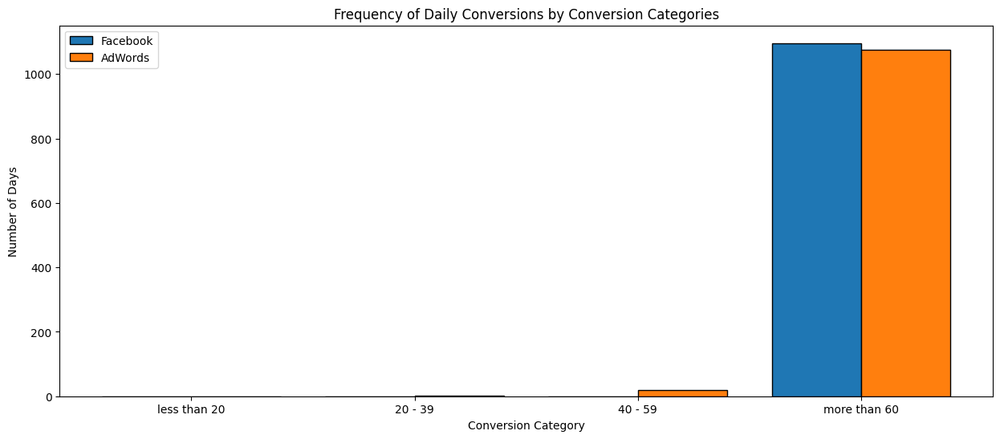
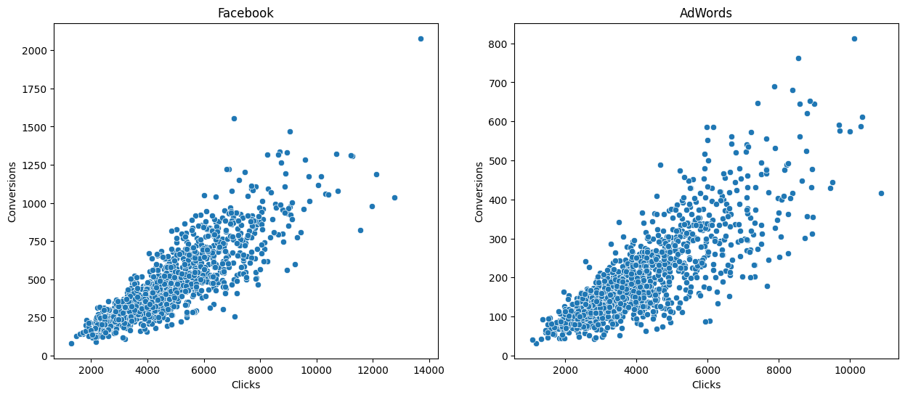
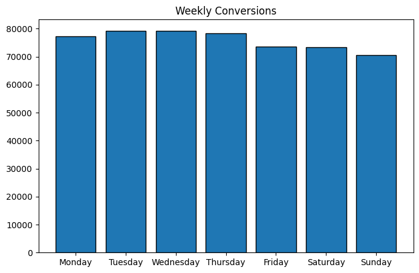
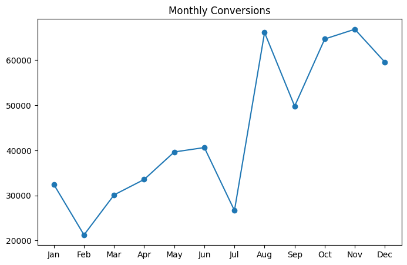
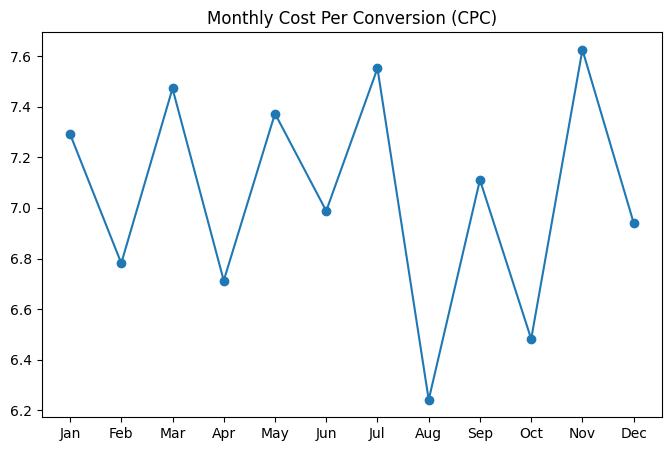
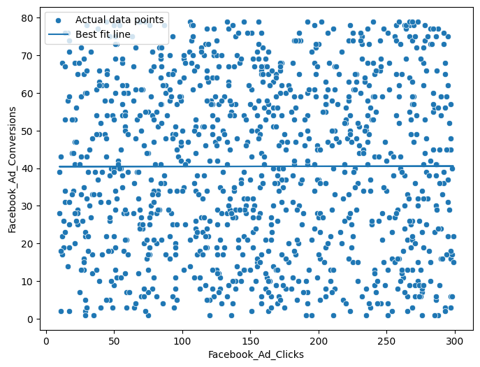

# 📊 Marketing Campaign Analysis using Python

<p align="center">
  
  
  
  
  
  
</p>

<p align="center">
  
  
  
  
</p>

---

## 🎯 Project Overview

Marketing teams invest heavily in advertising campaigns, but an important question remains:

> Do more clicks actually lead to more conversions?

This project analyses Facebook and AdWords campaign performance using Python, Statistics, and Machine Learning techniques to uncover trends, compare campaign effectiveness, evaluate advertising costs, and predict conversions.

The project combines:

✅ Exploratory Data Analysis (EDA)

✅ Statistical Hypothesis Testing

✅ Correlation Analysis

✅ Time-Series Trend Analysis

✅ Linear Regression Modelling

✅ Business Insights Generation

---

## 🛠️ Tech Stack

| Category | Tools |
|----------|--------|
| Language | Python |
| Data Analysis | Pandas, NumPy |
| Visualization | Matplotlib, Seaborn |
| Statistics | SciPy, Statsmodels |
| Machine Learning | Scikit-Learn |
| Environment | Jupyter Notebook |
| Version Control | Git & GitHub |

---

## 📂 Project Structure

```text
marketing-campaign-analysis-python/

├── data/
│   └── marketing_campaign_large.csv
│
├── images/
│   ├── adwords_ad_histograms.png
│   ├── clicks_vs_conversions_scatter.png
│   ├── conversion_category_frequency.png
│   ├── facebook_ad_histograms.png
│   ├── facebook_clicks_vs_conversions_regression.png
│   ├── monthly_conversions.png
│   ├── monthly_cost_per_conversion.png
│   └── weekly_conversions.png
│
├── notebooks/
│   └── main.ipynb
│
├── README.md
├── LICENSE
└── .gitignore
```

---

## 📊 Business Questions Answered

### 1️⃣ How are Facebook and AdWords campaigns performing?

- Compared click behaviour
- Compared conversion behaviour
- Analysed campaign effectiveness

### 2️⃣ Do more clicks generate more conversions?

- Scatter Plot Analysis
- Correlation Analysis
- Linear Regression Modelling

### 3️⃣ Which conversion categories occur most frequently?

- Low Conversion Days
- Medium Conversion Days
- High Conversion Days

### 4️⃣ What days generate maximum conversions?

- Weekly Trend Analysis

### 5️⃣ Which months perform best?

- Monthly Conversion Analysis

### 6️⃣ Is advertising cost impacting conversions?

- Cost Per Conversion Analysis
- Cointegration Testing

---

# 📈 Visualizations

## Facebook Click & Conversion Distribution



---

## AdWords Click & Conversion Distribution



---

## Conversion Category Comparison



---

## Clicks vs Conversions



---

## Weekly Conversion Trend



---

## Monthly Conversion Trend



---

## Monthly Cost Per Conversion



---

## Linear Regression Model



---

# 📊 Statistical Analysis

### Correlation Analysis

Measured the relationship between:

- Facebook Clicks vs Conversions
- AdWords Clicks vs Conversions

### Independent T-Test

Used to determine whether the average conversions between campaigns differ significantly.

### Cointegration Test

Used to examine long-term equilibrium relationships between:

- Advertising Cost
- Conversion Performance

---

# 🤖 Machine Learning

## Linear Regression

The model predicts:

> Expected Conversions based on Ad Clicks

### Evaluation Metrics

- R² Score
- Mean Squared Error (MSE)

---

# 🔍 Key Insights

✔ Facebook generated stronger conversion performance.

✔ Higher click volume generally resulted in higher conversions.

✔ Weekly conversion patterns remained relatively stable.

✔ Monthly trends revealed seasonal fluctuations.

✔ Cost-per-conversion varied significantly across months.

✔ Linear Regression successfully modelled conversion behaviour.

---

## 🚀 How To Run

### Clone Repository

```bash
git clone https://github.com/mukherjeesourav687/marketing-campaign-analysis-python.git
```

### Navigate

```bash
cd marketing-campaign-analysis-python
```

### Install Dependencies

```bash
pip install -r requirements.txt
```

### Launch Notebook

```bash
jupyter notebook
```

---

## 👨‍💻 Author

### Sourav Mukherjee

Data Analyst | SQL | Python | Power BI | Excel

📌 Passionate about transforming raw data into actionable insights.

---

## ⭐ Support

If you found this project useful:

⭐ Star the repository

🍴 Fork the repository

📢 Share with fellow data enthusiasts

---

<p align="center">
<b>Turning Marketing Data Into Business Decisions 📈</b>
</p>
